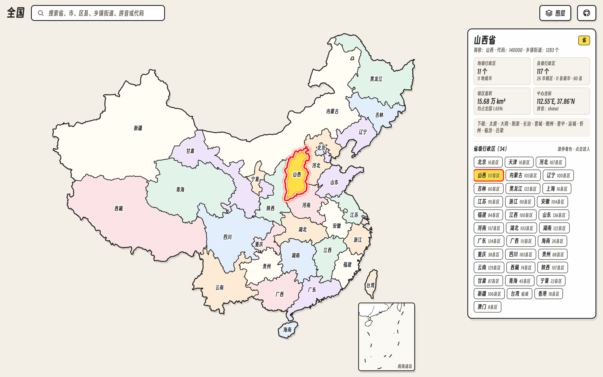
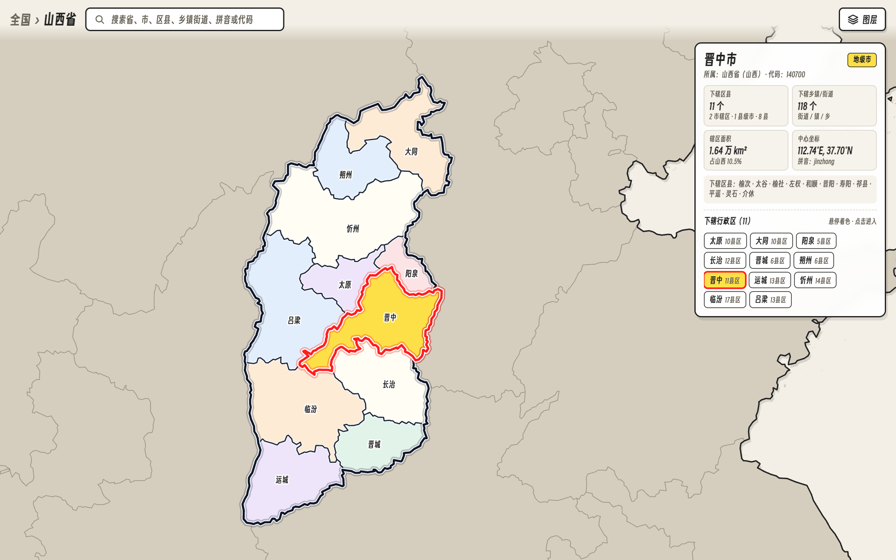
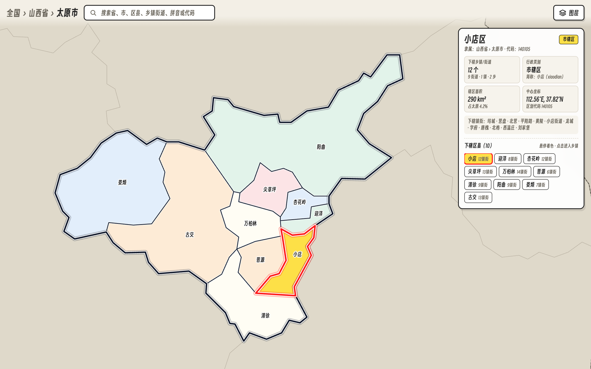
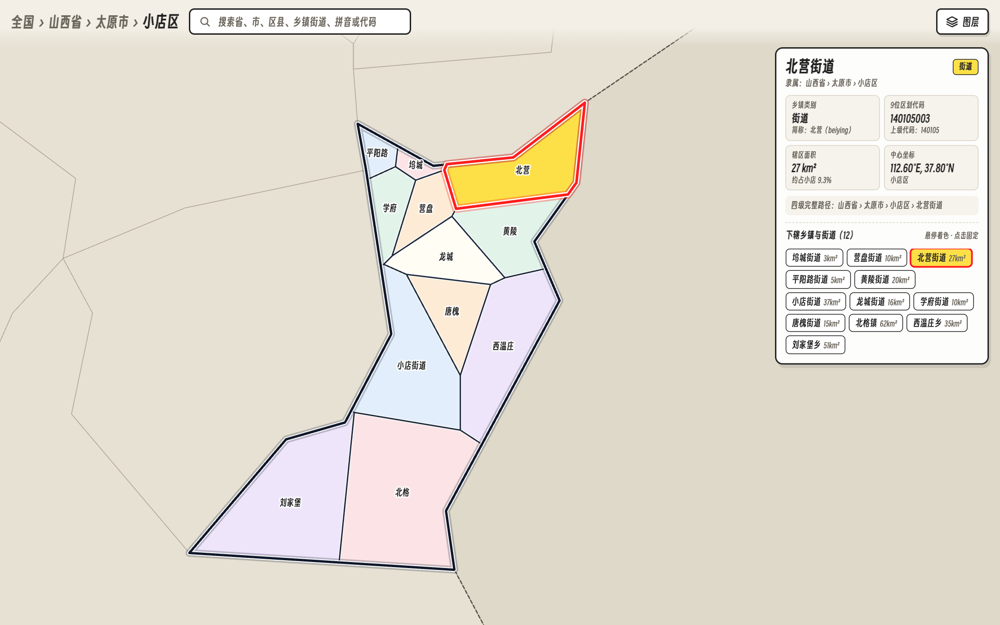

# YuTuZhi · 舆图志

<p align="center">
  <strong>中国「全国 ⇄ 省 ⇄ 市 ⇄ 区县 / 乡镇街道」四级行政区划交互探索地图</strong>
</p>

<p align="center">
  <a href="https://github.com/ixxxxoooo/yutuzhi/blob/main/LICENSE"></a>
  <a href="https://vitejs.dev/"></a>
</p>

**YuTuZhi（舆图志）** 是一个纯前端、零后端依赖的中国四级行政区划交互式探索地图，覆盖全国 **34** 个省级行政区、**333** 个地级行政区（含 30 个省直辖县级单位合计 370 个地级节点）、**2,875** 个县级行政区以及 **38,717** 个乡镇与街道办事处。



---

## ✨ 核心特性

### 1. 全国 ⇄ 省 ⇄ 市 ⇄ 区县（乡镇/街道）四级交互
- **逐级下钻**：支持从全国视图点击进入省份 → 地级市 → 区县（展开下辖乡镇与街道），也支持通过右侧行政区列表或顶部全量搜索框一键直达任意层级。
- **平滑缩放与自动跨级回退**：支持鼠标滚轮与触控板以光标为中心无漂移缩放；在区县、市、省视图下向外缩小越过阈值时，自动平滑回退到上一层级（`区县 → 市 → 省 → 全国`）。
- **URL Hash 路由直达**：支持通过 `#/140000`（山西省）、`#/140100`（太原市）、`#/140105`（小店区）、`#/140105003`（北营街道）直接分享与定位。

| 省级视图（地级市分区） | 市级视图（区县分区） | 区县视图（乡镇/街道分区） |
| :---: | :---: | :---: |
|  |  |  |

### 2. 四层舆图视觉层级与边缘高亮系统
- **非激活板块退后压暗**：进入省/市/区县视图后，周边非当前板块自动退后为暖石灰底板并隐去细碎边界。
- **当前板块三层立体外框**：自动提取当前省/市/区县最外圈轮廓，叠加外投影、亮白护圈与深墨粗外框，使当前板块整体从周边环境中立体浮出。
- **拓扑六色舆图色板 + 双层衬边分界线**：基于共享边界顶点构建拓扑邻接图，为相邻子区域分配互不冲突的六色柔和舆图色板，并配合白底衬边 + 深墨实线勾勒清晰内界。
- **鼠标悬停焦点环**：鼠标指向任意区域时，该块立即以高饱和暖金着色，并叠加顶层「红晕外发光 + 纯白隔离环 + 朱红粗描边」，同步在跟随浮窗与右侧面板实时展示该区域的下辖数量、辖区面积、中心坐标与区划代码。

### 3. 多源真实地理底图与图层叠加
支持在 Albers 等积圆锥投影（`+80,000×`）下实时重投影瓦片，无缝切换 5 种底图模式：
- **纸质浅色底图（默认）**：纯净低噪点矢量舆图风格
- **标准街道地图**：街道道路与水系瓦片重投影
- **卫星遥感影像**：高清卫星影像（自动切换暗色反白边界与标签）
- **等高线地形图**：OpenTopoMap 地形等高线底图
- **山体阴影地貌**：World Shaded Relief 纯地貌起伏渲染

### 4. 毫秒级四级全文检索
内置支持 **34 省 + 370 地级 + 2,875 区县 + 38,717 乡镇/街道** 的即时搜索器，支持按名称、简称、拼音首字母、全拼或 6～9 位行政区划代码检索定位。

---

## 📊 数据概览与来源

| 层级 | 数量 | 数据来源与处理说明 |
| :--- | :--- | :--- |
| **省级行政区** | 34 个 | 23 省、5 自治区、4 直辖市、2 特别行政区（Alibaba DataV GeoAtlas） |
| **地级行政区** | 333 个（+30 省直辖县级） | 293 地级市、30 自治州、7 地区、3 盟，以及济源、仙桃、神农架、海南直辖县、新疆兵团市等 |
| **县级行政区** | 2,875 个 | 市辖区、县级市、县、自治县、旗、自治旗、林区、特区（mapshaper 拓扑修复 + 双精度简化） |
| **乡镇级行政区** | 38,717 个 | 融合国家统计局四级统计用区划代码（`AreaCity-JsSpider-StatsGov`）与民政部/高德真实乡镇驻地坐标（GCJ-02），在区县精细边界内执行真实驻地坐标 Voronoi 辖区剖分 |

---

## 🚀 本地开发与构建

### 环境要求
- **Node.js** >= 18.0.0
- **npm** >= 9.0.0

### 安装与启动

```bash
# 克隆仓库
git clone https://github.com/ixxxxoooo/yutuzhi.git
cd yutuzhi

# 安装依赖
npm install

# 启动本地开发服务器（默认 http://localhost:5173）
npm run dev
```

### 常用命令

| 命令 | 说明 |
| :--- | :--- |
| `npm run dev` | 启动 Vite 本地开发服务器（热更新） |
| `npm run build` | 生成生产环境静态产物至 `dist/` 目录 |
| `npm run preview` | 本地预览 `dist/` 生产构建结果 |
| `npm run check` | 运行地图拓扑完整性、四级乡镇数据与字体覆盖自检 |
| `npm run font` | 重新扫描源码字符并生成 `src/fonts/cityex-sans.woff2` 字体子集 |

---

## 📁 目录结构

```text
yutuzhi/
├── docs/                   # 预览截图与开发文档 (DEVELOPMENT.md)
├── public/                 # 公共静态资源与字体协议 (OFL.txt, og.jpg)
├── scripts/                # 数据抓取、拓扑构建、字体子集化与自检脚本
│   ├── build-font.mjs      # 得意黑字体子集提取与重命名
│   ├── build-map.mjs       # GeoJSON 拓扑修复、两级简化与 Albers 投影
│   ├── chars.mjs           # 源码与数据中文字符收集器
│   ├── check.mjs           # 数据与字体完整性自检脚本
│   ├── config.mjs          # 特殊行政区与简称规则配置
│   └── fetch-data.mjs      # 原始边界与字体素材拉取脚本
├── src/                    # 前端核心源码
│   ├── basemap.js          # 多源瓦片底图 Albers 逆投影渲染引擎与图层菜单
│   ├── card.css            # 地图阴影与南海插图卡片样式
│   ├── dom.js              # DOM 辅助工具
│   ├── gesture.js          # 拖拽平移、光标中心缩放与缩小跨级回退引擎
│   ├── label-layout.js     # 行政区名称碰撞避让与引线布局算法
│   ├── locator.js          # 省/市/县/镇四级全文搜索与快速定位面板
│   ├── main.js             # 应用主入口、四级路由与详情卡片渲染
│   ├── map-data.json       # 首屏粗精度矢量边界与省/市/县元数据
│   ├── map-fine.json       # 按需加载的高精度矢量边界数据
│   ├── map.js              # SVG 地图构建、外轮廓提取、拓扑六色着色与乡镇剖分
│   ├── style.css           # 全局样式与四级视觉高亮系统
│   └── towns-data.json     # 全国 38,717 个乡镇/街道数据与真实 GCJ-02 坐标
├── index.html              # 页面入口
├── package.json            # 项目配置与依赖
└── vite.config.js          # Vite 构建配置
```

---

## 🤝 参与贡献

欢迎提交 Issue 或 Pull Request 参与改进，详情请查阅 [CONTRIBUTING.md](CONTRIBUTING.md) 与 [开发文档](docs/DEVELOPMENT.md)。

## 📄 开源协议与致谢

- 本项目源代码基于 **[MIT License](LICENSE)** 开源。
- 字体与地理数据等第三方素材的版权与使用声明请参见 **[NOTICE](NOTICE)**。
- 早期基础框架灵感源自 [itorr/china-ex](https://github.com/itorr/china-ex) 与 [IdealistYu/city-ex](https://github.com/IdealistYu/city-ex)。
